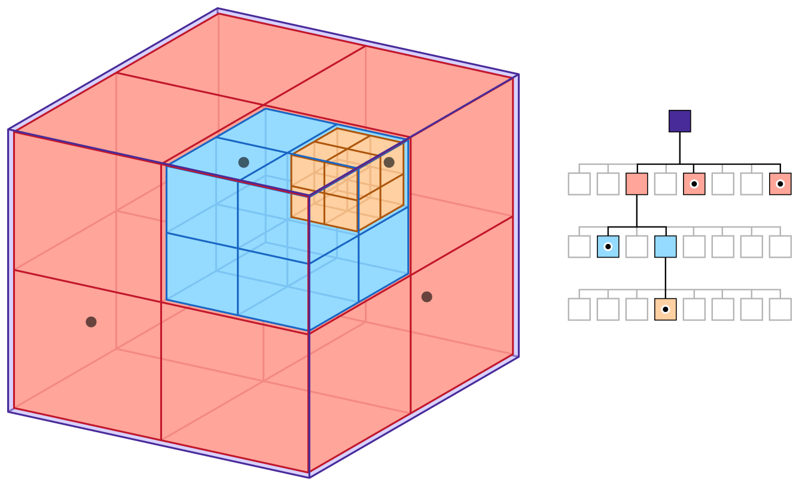

# Library Architecture {#mainpage}
# Introduction
The voxomap container was build to be used like a std container. It is templated on user data and it is possible to browse it with iterators.

 
______
 

# Octree Representation

The library is based on an [octree](https://en.wikipedia.org/wiki/Octree), it's a tree data structure in which each internal node has exactly eight children.
Octrees are used to partition a three-dimensional space by recursively subdividing it into eight octants/nodes.
The bottom level of the octree consists of leaf nodes that contain the voxels (user data).
Octrees are the three-dimensional analog of quadtrees.

 

 
______
 

# Voxel Area Representation

The leaf nodes of the VoxelOctree, that have size of 8, contain voxel area. A voxel area is a structure that contains voxels, it can contain 8x8x8(512) voxels. The VoxelArea fills all its octants/nodes, so like its container, it is axis aligned. The library allows to implement different type of voxel area. There are two implementations, but it's easy to create a new one that will better suit your needs.

This structure only exists for improved performance and memory. This mixture between octree and array allows to take advantage of both structure without taking their disadvantages. Indeed, an octree has advantage to be dynamic and to not store empty space but can take lot of memory to store all its nodes and it's heavy to go through. An array, meanwhile, has advantage to store only user information (no nodes) and it's fast to go through but stores the empty space and is difficult to grow.

This structure doesn't store empty space (when no voxels, no voxel areas and no nodes), uses less nodes (voxel area inside node of size 8), it's easy to grow (advantage of a tree) and the performance for going through are very good (not so far from an array).

 
______
 

## ArrayArea

This structure is based on a fixed size 3D array that contains the user data. It's a very simple structure that is useful for high density of voxels.
- Advantage
  - Good global performances
- Disadvantage
  - Big memory footprint (RAM and serialized), same memory footprint with 1 or 512 voxels.

**Warning**: For use this structure, the user data structure must override the boolean operator to know if it's an empty voxel or not.

 

 
______
 

## SmartArea

This structure is a mix between a fixed size 3D array (like in ArrayArea) and a dynamic array. Useful for little density of voxels.
- Advantages:
  - Good access/update performance (~= ArrayArea)
  - Small memory footprint
- Disadvantages:
  - Less performant on add/remove than the ArrayArea
  - Bigger memory footprint than the ArrayArea when high density

 
The area uses 3 containers:
- (A) fixed size 3D array of size 8x8x8 that contains ids on (B), initialized to 0. The array uses 512 bytes when there is less than 255 voxels and 1024 bytes if more.
- (B) dynamic array that contains the user data
- (C) dynamic array that contains ids of free space into (B). Due to performance issue, the deleted voxels are not removed from (B), they are just marked as free.

 

 
______
 

# Which area to use?
| Size of voxel | Number of voxels | ArrayArea | SmartArea |
| :-----------: | :--------------: | :-------: | :-------: |
|    1 byte     |                  |     X     |           |
|  >= 2 bytes   |     <= 255       |           |     X     |
| ^             |   &nbsp; > 255   |     X     |           |

 
This comparative table is just here to give you an idea of what to use.

It's just a simple calculation:
- ArrayArea = voxel_size * 512
- SmartArea(<= 255 voxels) = voxel_size * number_voxel + 512
- SmartArea(> 255 voxels) = voxel_size * number_voxel + 1024
